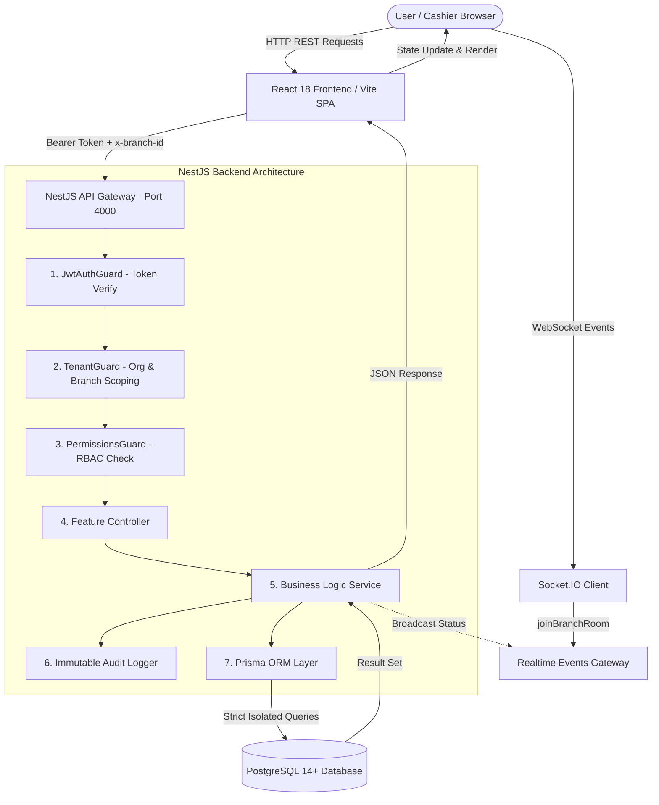
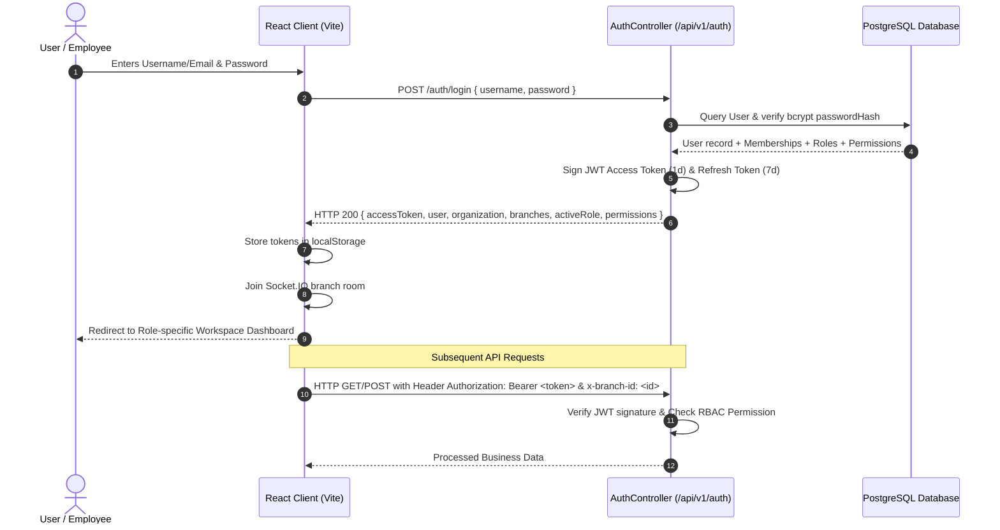

# AESCION Commerce — Website Workflow and Testing Guide

> **Document Version:** 2.0.0  
> **Target Audience:** Quality Assurance Engineers, Product Architects, Security Auditors, Developers  
> **Source Repository Path:** `C:\Users\esakk\.gemini\antigravity-ide\scratch\aescion_billing_app`

---

## 1. System Architecture Workflow

AESCION Commerce operates as a multi-tenant, role-governed enterprise application. Data flows strictly through tenant-isolated pipelines with authoritative backend validation.



---

## 2. Complete Route and Page Map

| Page Name | Frontend Route | Allowed Roles | Purpose & Core Capabilities | Primary APIs Consumed | Mobile Ready |
| :--- | :--- | :--- | :--- | :--- | :---: |
| **Landing Page** | `/` (Unauthenticated) | Public | Brand introduction, feature showcase, login & onboarding triggers | None | Yes |
| **Dashboard Pulse** | `/dashboard` | Owner, Manager, Admin | Real-time gross revenue, bill count, collections breakdown, inventory alerts | `GET /reports/dashboard-pulse` | Yes |
| **Fast Billing POS** | `/pos` | Owner, Manager, Cashier | Barcode search, cart builder, customer tagging, cash/UPI checkout, receipt print | `GET /products`, `POST /invoices` | Yes |
| **Cashier Shifts** | `/supermarket/shifts` | Owner, Manager, Cashier | Shift drawer opening float, live cash sales calculation, closing cash count | `GET/POST /cashier-shifts/*` | Yes |
| **Products & Stock**| `/products` | Owner, Manager, Inventory | Item catalog master, unit pricing, barcode assignment, stock balance audit | `GET/POST/PUT /products` | Yes |
| **Stock Ledger** | `/inventory` | Owner, Manager, Inventory | Immutable ledger tracking (`SALE`, `PURCHASE_RECEIPT`, `SALE_RETURN`, `TRANSFER`) | `GET /products/stock/ledger` | Yes |
| **Quotations** | `/billing/quotations` | Owner, Manager, Accountant | Commercial pre-sales estimates, multi-line pricing, single-click invoice conversion | `GET/POST/PUT /quotations/*` | Yes |
| **Invoices Ledger** | `/billing/invoices` | Owner, Manager, Accountant | Official GST invoices ledger, payment status tracking, voiding with stock restoration | `GET/PUT /invoices/*` | Yes |
| **Payments & Receipts**| `/billing/receipts` | Owner, Manager, Cashier | Dedicated payment receipts ledger, multi-tender audit, safe read-only reprint | `GET /payments/receipts/*` | Yes |
| **Customers & Credit**| `/management/customers`| Owner, Manager, Accountant | Customer master directory, credit limits, ledger history, 30/60/90 ageing | `GET/POST/PUT /customers/*` | Yes |
| **Suppliers & POs** | `/management/suppliers`| Owner, Manager, Inventory | Vendor directory, Purchase Orders creation, Goods Received Note (GRN) intake | `GET/POST/PUT /suppliers/*` | Yes |
| **Team & Access** | `/management/team` | Owner, Manager | Staff directory, employee onboarding, outlet assignment, active status toggle | `GET/POST/PUT /team/members` | Yes |
| **Roles Matrix** | `/management/roles` | Owner, Super Admin | Interactive grouped permission matrix, custom role creation, RBAC editor | `GET/POST/PUT /team/roles` | Yes |
| **Outlets & Branches**| `/management/branches`| Owner, Super Admin | Multi-store directory, branch creation, POS register counter management | `GET/POST/PUT /branches/*` | Yes |
| **Reports & Audits** | `/management/reports` | Owner, Manager, Accountant | Top selling items ranking, invoice audit logs, cashier shift reconciliation | `GET /reports/summary` | Yes |
| **Business Settings** | `/management/settings`| Owner, Super Admin | Legal business profile, GSTIN, inclusive/exclusive tax mode, document prefixes | `GET/PUT /organizations/settings` | Yes |

---

## 3. Role-Based Access Control (RBAC) Matrix

AESCION Commerce implements strict server-side permission resolution. Menu item visibility in the UI is augmented by mandatory backend `@RequirePermissions()` decorators.

| Functional Capability | Super Admin | Owner | Manager | Cashier | Accountant | Inventory Staff | Technician |
| :--- | :---: | :---: | :---: | :---: | :---: | :---: | :---: |
| **Access Dashboard Pulse** | Yes | Yes | Yes | No | Yes | No | No |
| **Fast POS Billing Terminal**| Yes | Yes | Yes | Yes | No | No | No |
| **Open / Close Cashier Shift**| Yes | Yes | Yes | Yes | No | No | No |
| **Apply POS Discounts** | Yes | Yes | Yes | No | No | No | No |
| **View Products Catalog** | Yes | Yes | Yes | Yes | Yes | Yes | Yes |
| **Create & Edit Products** | Yes | Yes | Yes | No | No | Yes | No |
| **Manual Stock Adjustments** | Yes | Yes | Yes | No | No | Yes | No |
| **Create Quotations** | Yes | Yes | Yes | No | Yes | No | No |
| **Convert Quote to Invoice** | Yes | Yes | Yes | No | No | No | No |
| **Void / Cancel Invoices** | Yes | Yes | Yes | No | No | No | No |
| **Collect Payments** | Yes | Yes | Yes | Yes | Yes | No | No |
| **Reprint Receipts** | Yes | Yes | Yes | Yes | Yes | No | No |
| **Manage Customer Credit** | Yes | Yes | Yes | No | Yes | No | No |
| **Issue Purchase Orders** | Yes | Yes | Yes | No | No | Yes | No |
| **GRN Stock Intake** | Yes | Yes | Yes | No | No | Yes | No |
| **Onboard Team Employees** | Yes | Yes | Yes | No | No | No | No |
| **Modify Role Permissions** | Yes | Yes | No | No | No | No | No |
| **Create Store Outlets** | Yes | Yes | No | No | No | No | No |
| **Modify Business Settings**| Yes | Yes | No | No | No | No | No |

---

## 4. Authentication & Authorization Workflow



---

## 5. Feature-by-Feature Operational Workflows

### 5.1 Business Onboarding & Multi-Tenant Setup
* **Trigger**: Click "Get Started" on the landing page.
* **Process**: 9-step atomic onboarding wizard:
  1. Business Classification (Supermarket, Retail, Wholesale, Restaurant, Service, Pharmacy).
  2. Legal Business Identity (Trade Name, GSTIN, Address, City, State, PIN).
  3. Primary Branch Creation (Code, Address, Contact).
  4. Team Setup Mode (`JUST_ME` or `INVITE_STAFF`).
  5. Tax Mode (`EXCLUSIVE` or `INCLUSIVE` with 0%, 5%, 12%, 18%, 28% slabs).
  6. Document Numbering Prefixes (`INV`, `QTN`, `RCP`).
  7. Owner Administrator Account Registration.
  8. Automatic starter catalog item seeding.
  9. Automatic login and session token issuance.
* **Database Models**: `Organization`, `Branch`, `Register`, `User`, `Membership`, `Role`, `TaxSettings`, `DocumentSettings`, `Product`.

---

### 5.2 Fast Billing POS & Checkout
* **Trigger**: Click "Fast Billing (POS)" in sidebar (`/pos`).
* **Process**:
  1. Cashier scans barcode or searches catalog item by name.
  2. Item added to active cart with line quantity, unit price, and GST breakdown.
  3. Cashier selects customer (Walk-in or registered corporate customer).
  4. Tender method selected: **CASH**, **UPI**, **CARD**, or **CUSTOMER CREDIT**.
  5. Cashier enters amount tendered; system computes change due.
  6. Click "Complete Bill & Print Receipt".
  7. **Backend Actions**:
     - Creates immutable `Invoice` record.
     - Decrements `Product.currentStock` strictly by line quantities.
     - Logs immutable `StockLedger` audit entry with `transactionType: SALE`.
     - Generates `Payment` and thermal `Receipt` records.
     - Emits WebSocket event updating live dashboard pulse.

---

### 5.3 Cashier Shifts & Cash Drawer Reconciliation
* **Trigger**: Navigate to `/supermarket/shifts`.
* **Process**:
  1. **Shift Opening**: Cashier enters opening drawer float (e.g., ₹2,500) and clicks "Open Shift".
  2. **Active Operations**: All completed cash sales automatically accumulate in real-time.
  3. **Live Expected Cash Calculation**: `expectedCash = openingFloat + totalCashSales`.
  4. **Shift Closure**: Cashier counts physical cash in drawer, enters `actualCashCounted` and closing notes.
  5. **Variance Audit**: System computes `cashDifference = actualCashCounted - expectedCash` and sets shift status to `CLOSED`.

---

### 5.4 Quotations & Estimates with Safe Single-Conversion
* **Trigger**: Navigate to `/billing/quotations`.
* **Process**:
  1. Create multi-line estimate with product items, custom quantities, and GST rates.
  2. **Safety Rule**: Creating a quotation **NEVER** deducts inventory stock.
  3. Quotation status updated through `DRAFT` ➔ `SENT` ➔ `ACCEPTED`.
  4. Click "Convert to Invoice":
     - Backend verifies status is not already `CONVERTED`.
     - Generates official `Invoice` record.
     - Deducts inventory stock from database.
     - Updates Quotation status to `CONVERTED`.
     - **Idempotency Protection**: Duplicate clicks or retries immediately return `409 Conflict`.

---

### 5.5 Invoices Ledger & Void Inventory Restoration
* **Trigger**: Navigate to `/billing/invoices`.
* **Process**:
  1. Filter invoices by status (`PAID`, `PARTIALLY_PAID`, `ISSUED`, `VOID`).
  2. Click "View / Print" to open 80mm thermal receipt or A4 full tax invoice layout.
  3. Click "Void" on an erroneous bill:
     - Prompts for mandatory cancellation reason.
     - Invoice status updated to `VOID`.
     - **Stock Restoration**: All line items are automatically restored to inventory, and `StockLedger` records a `SALE_RETURN` audit event.

---

### 5.6 Suppliers, Purchase Orders & GRN Stock Intake
* **Trigger**: Navigate to `/management/suppliers`.
* **Process**:
  1. Register vendor company, contact person, phone, and GSTIN.
  2. Issue Purchase Order (PO) specifying ordered quantities and supplier unit costs.
  3. When shipment arrives at warehouse, click "Receive (GRN)":
     - Generates Goods Received Note (GRN).
     - PO status marked as `COMPLETED`.
     - **Stock Increment**: Product inventory balances are immediately credited in PostgreSQL.

---

### 5.7 Granular RBAC Role & Permission Editing
* **Trigger**: Navigate to `/management/roles` or `/management/team` (Roles tab).
* **Process**:
  1. View system roles (`OWNER`, `MANAGER`, `CASHIER`, `ACCOUNTANT`, `INVENTORY_STAFF`) and custom business roles.
  2. Click "Edit Permissions" on any permitted role.
  3. Toggle granular permissions across grouped functional domains:
     - Dashboard & Reports
     - Fast POS & Shifts
     - Products & Inventory
     - Quotations & Invoices
     - Payments & Receipts
     - Customers & Suppliers
     - Outlets & Settings
     - Industry Modules
  4. Click "Save Changes":
     - Backend validates organization ownership and ensures system Owner access cannot be stripped.
     - Updates `Role.permissions` in PostgreSQL.
     - Immediately governs user permissions without page reloads.

---

## 6. End-to-End Desktop Verification Test Cases

| Test ID | Role | Preconditions | Starting URL | Steps | Expected Result | Status |
| :--- | :--- | :--- | :--- | :--- | :--- | :---: |
| **TC-E2E-01** | Public | Fresh environment | `http://localhost:5173/` | Complete 9-step business onboarding | Organization & Admin user created; redirected to Dashboard | PASS |
| **TC-E2E-02** | Owner | Logged in | `/pos` | Add product to cart, tender ₹500 cash | Invoice generated, stock deducted, receipt displayed | PASS |
| **TC-E2E-03** | Cashier | Logged in | `/supermarket/shifts` | Open shift with ₹2000 float, close with ₹2000 | Shift opened, reconciled, and closed with 0 variance | PASS |
| **TC-E2E-04** | Manager | Logged in | `/billing/quotations` | Create quotation for 5 units | Quotation saved; stock balance remains unchanged | PASS |
| **TC-E2E-05** | Manager | Logged in | `/billing/quotations` | Convert accepted quotation to invoice | Invoice created, stock reduced by 5; repeat returns 409 Conflict | PASS |
| **TC-E2E-06** | Accountant | Logged in | `/billing/invoices` | Void an issued invoice | Status set to VOID; line items restored to inventory ledger | PASS |
| **TC-E2E-07** | Cashier | Logged in | `/billing/receipts` | Reprint an existing payment receipt | Receipt displayed; 0 duplicate transactions created | PASS |
| **TC-E2E-08** | Inventory | Logged in | `/management/suppliers` | Issue PO for 50 units, click Receive GRN | Stock balance increased by 50 units in database | PASS |
| **TC-E2E-09** | Owner | Logged in | `/management/roles` | Create custom role & toggle permissions | Permissions updated in PostgreSQL and applied dynamically | PASS |
| **TC-E2E-10** | Owner | Logged in | `/management/branches` | Add new store outlet & POS counter | Branch created and selectable in branch context switcher | PASS |

---

## 7. End-to-End Mobile Responsive Verification Test Cases

| Test ID | Target Viewport | Screen / View | Verification Steps | Expected Responsive Behavior | Status |
| :--- | :--- | :--- | :--- | :--- | :--- | :---: |
| **TC-MOB-01** | `375 x 667` (iPhone SE) | Landing Page | Open landing page, tap "Sign In" modal | Dialog centers on screen with accessible touch inputs | PASS |
| **TC-MOB-02** | `390 x 844` (iPhone 14) | Dashboard Pulse | View revenue KPI cards | KPI cards stack vertically into single readable column | PASS |
| **TC-MOB-03** | `390 x 844` (iPhone 14) | Fast Billing POS | Search item, tap to add, open checkout | Cart drawer expands cleanly; tender buttons full width | PASS |
| **TC-MOB-04** | `428 x 926` (iPhone Plus) | Invoices Table | Open invoices ledger table | Table scrolls horizontally inside card without page overflow | PASS |
| **TC-MOB-05** | `768 x 1024` (iPad Mini) | Products Catalog | Browse item catalog grid | Adapts cleanly to 2-column responsive layout | PASS |
| **TC-MOB-06** | `390 x 844` (iPhone 14) | Shift Reconciliation| Open and close cashier shift | Numeric float inputs keypad friendly; receipt preview legible | PASS |

---

## 8. Summary of Completed vs. Hardware-Dependent Features

```
================================================================================
                    AESCION COMMERCE STATUS SUMMARY
================================================================================

[✓] COMPLETED & VERIFIED IN CODEBASE:
  • Multi-tenant isolated database schema with foreign constraints & indexes
  • Complete 9-step atomic business onboarding wizard
  • Authoritative GST calculation engine (0%, 5%, 12%, 18%, 28% CGST/SGST/IGST)
  • Fast POS checkout with barcode lookup and hold/recall orders
  • Cashier shifts lifecycle with live expected cash & drawer variance
  • Quotations with draft/sent/accepted states and safe single-conversion
  • Invoices ledger with void cancellation and automatic stock restoration
  • Payments & Receipts ledger with safe read-only reprints
  • Customer directory, credit limit enforcement, and 30/60/90 ageing
  • Suppliers vendor master, Purchase Orders, and GRN stock intake
  • Team member onboarding, branch assignment, and active status toggle
  • Interactive grouped RBAC permission editor with database persistence
  • Multi-branch store outlets directory and POS register management
  • Real-time business pulse and aggregated analytics reporting
  • 6 Industry packs (Supermarket, Retail, Wholesale, Restaurant, Service, Pharmacy)

[⏳] EXTERNAL / HARDWARE VERIFICATION PENDING:
  • Physical USB/ESC-POS thermal printer hardware attachment (Clean adapter ready)
  • Physical RS-232 serial weighing scale hardware attachment (Clean adapter ready)
================================================================================
```
